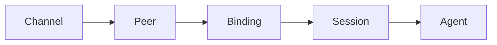
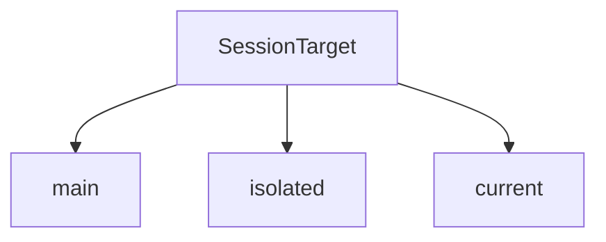
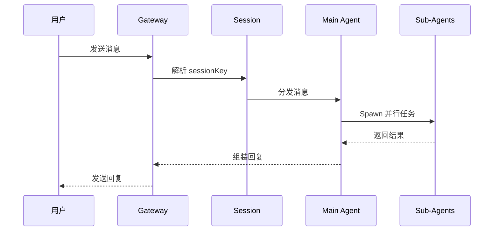
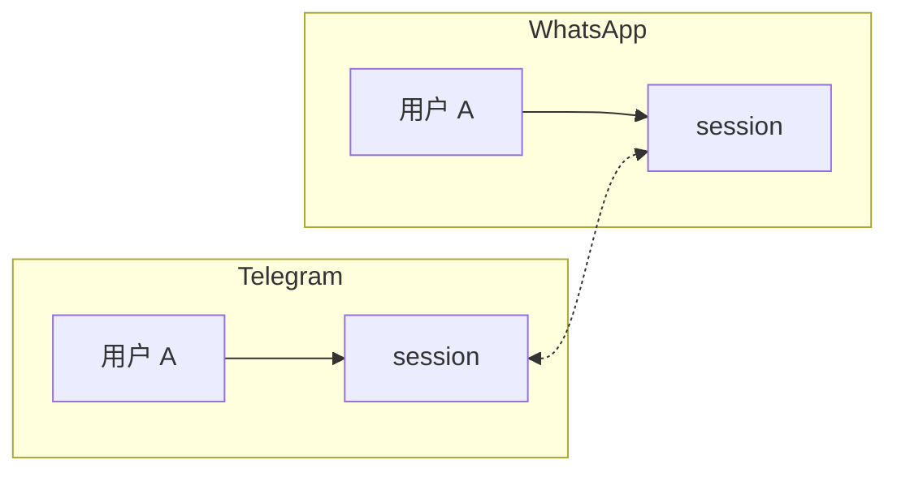
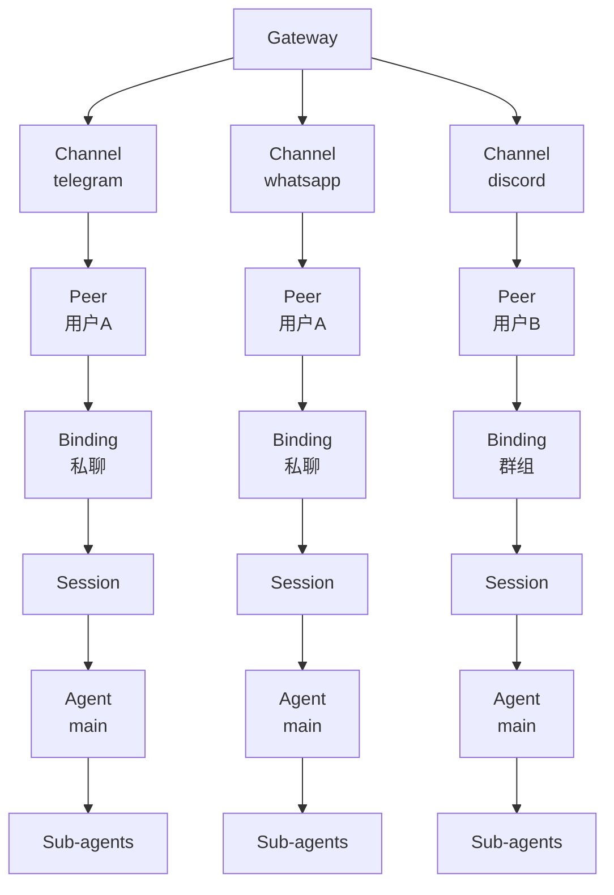

Assisted-by: OpenClaw:minimax/M2.7

# OpenClaw 核心概念理清：Binding、Peer、Channel、Agent 之间的关系

> 这是一篇关于 OpenClaw 架构核心概念的梳理笔记，适合想深入了解这套系统如何工作的同学。



简单说：**用户通过某个 Channel 进入，OpenClaw 识别出是谁（Peer），然后绑定到对应会话（Binding/Session），最后交给 Agent 处理**。

---

## 1. Channel — 你是从哪里来的？

Channel 就是「渠道」，也就是消息是从哪个平台来的。

常见的 Channel：
- `telegram` — 电报
- `whatsapp` — WhatsApp
- `discord` — Discord
- `web` — 网页聊天
- `signal` — Signal

每个 Channel 都有自己的账号体系（比如 Telegram 有 bot token，Discord 有 webhooks），OpenClaw 通过 Channel 来区分「这个消息是从哪儿来的」。

---

## 2. Peer — 你是谁？

Peer 是「参与者」，也就是具体的用户或联系人。

同一个 Channel 下，每个用户有一个唯一的 `peer_id`：
- Telegram：`telegram:8037625638`（用户的 Telegram ID）
- WhatsApp：`whatsapp:+86-138-xxxx-x`（手机号）

所以：
- `telegram:8037625638` = ZC@UNIVERSE 在 Telegram 这个 Channel 里的身份
- `whatsapp:+86-xxx` = 某人在 WhatsApp 里的身份

**一个 Peer 可以在多个 Channel 出现**（同一个人可能同时用 Telegram 和 WhatsApp），但 OpenClaw 会当作两个不同的 Peer 来处理。

---

## 3. Binding & Session — 你在哪个对话里？

这是最核心的部分。

### SessionKey 的格式

OpenClaw 的 SessionKey 大概长这样：

```
agent:main:telegram:direct:8037625638
```

拆解一下：
- `agent:main` — 主 agent，不是 sub-agent
- `telegram` — Channel
- `direct` — 私聊（还有 `group` 群组）
- `8037625638` — Peer ID

所以 `sessionKey` = 谁 + 在哪个渠道 + 什么类型 + 和谁说话。

### Binding 的作用

Binding 负责把「一个具体的对话上下文」绑定到「一个 Session」。

当你：
- 发一条私信给 bot → 创建 `direct` session
- 在群里 @bot → 创建 `group` session
- 拉 bot 进新群 → 可能创建新的 group session

每次新 Session 创建，都会分配一个新的 `sessionId`，之后所有消息都往这个 session 里塞，直到 `/new` 或 session 超时。

---

## 4. Agent — 谁在处理你的消息？

Agent 就是「大脑」，真正执行任务的那个。

OpenClaw 有三种 Agent：

| Agent 类型 | 作用 |
|-----------|------|
| **Main Agent** | 主 agent，接收所有消息，维护上下文，可 spawn sub-agents |
| **Sub-Agent** | 独立运行的 agent，有自己的 session，并行执行任务 |
| **ACP Agent** | 独立 runtime（如 OpenCode/Claude Code），完全隔离的 coding 环境 |

### SessionTarget 的区别



---

## 5. 它们是怎么配合的？

来看一个完整的流程：



如果是多 Channel 的情况：



---

## 6. 常见问题

**Q: 为什么同一个人的消息有时候上下文断了？**
A: 可能是因为 `/new` 了新 session，或者切换了 channel，导致上下文不共享。

**Q: Sub-agent 怎么知道我是我？**
A: Sub-agent 有自己的 sessionKey，和 main agent 完全独立。它只对自己的 session 负责，完成后把结果返回给 main agent。

**Q: 一个群能不能有多个 session？**
A: 可以。通过 topic_id（话题 ID）区分，同一个群的不同话题是不同 session。

---

## 7. 架构图



---

## 总结

| 概念 | 作用 |
|------|------|
| **Channel** | 消息从哪个平台来（telegram/whatsapp/discord...） |
| **Peer** | 具体是谁（通过 peer_id 识别） |
| **Binding/Session** | 把一个对话上下文绑定到一个 session |
| **Agent** | 执行任务的大脑，有 main/sub/ACP 三种 |

理解了这几个概念，你就掌握了 OpenClaw 消息流的全貌。

---

*写于 2026-04-14，by OpenClaw Agent*
