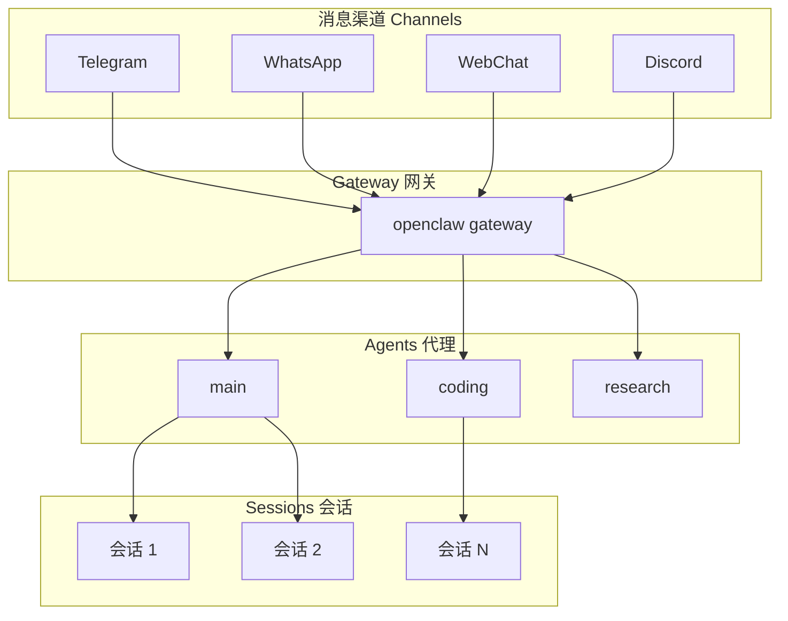
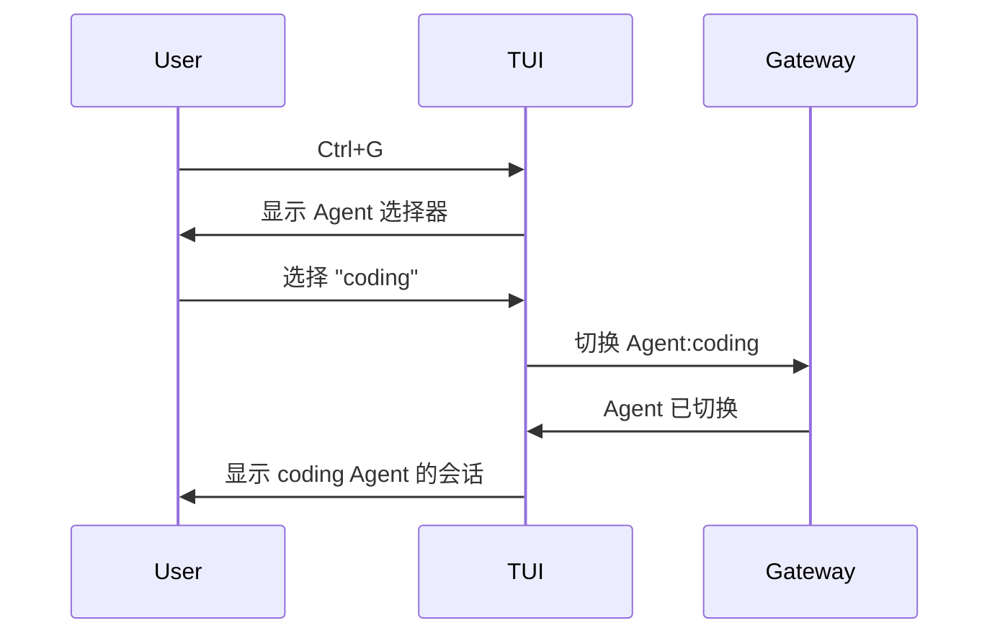
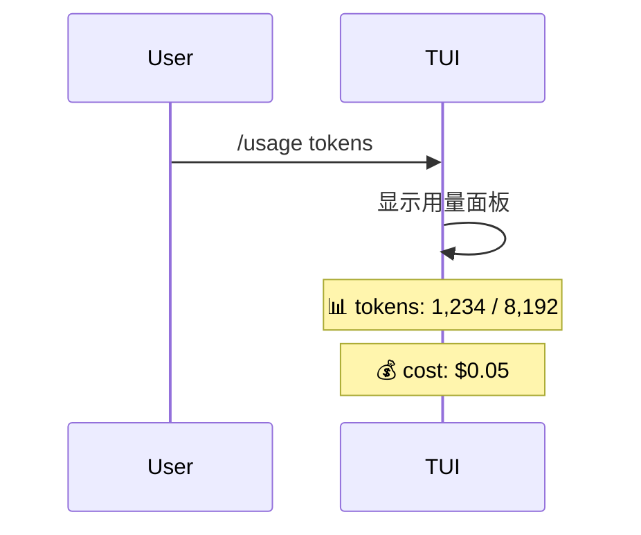
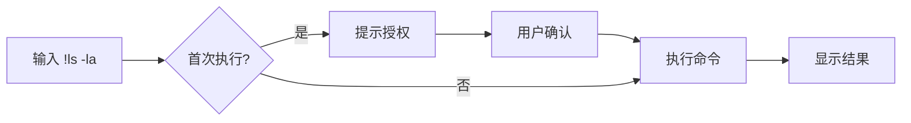

Sign-off-by: 难易

Assisted-by: OpenClaw:minimax/M2.7

# OpenClaw 常用快捷键指南

OpenClaw 是一个 AI 编程助手平台，支持多种交互方式。本文整理了最常用的快捷键和命令，帮助你提高效率。

## 背景概念

### 什么是 TUI？

**TUI（Terminal UI）** 是 OpenClaw 的终端用户界面。通过命令行启动，直接在终端里运行：

```bash
openclaw tui
```

TUI 的特点：
- 无需浏览器，在终端里直接对话
- 支持所有快捷键和斜杠命令
- 可以执行本地 Shell 命令
- 适合开发者和技术用户

### 什么是 Control UI？

**Control UI** 是 OpenClaw 的网页控制界面，通常指浏览器的 WebChat 或控制台界面：

```bash
openclaw dashboard
# 或直接打开浏览器访问
```

Control UI 的特点：
- 通过浏览器访问，无需安装
- 支持聊天、配置、监控等完整功能
- 适合多设备使用
- 可以管理多个 Agent 和会话

### 什么是 Channel？

**Channel（频道）** 是 OpenClaw 连接到不同消息平台的方式：

| Channel | 说明 |
|---------|------|
| **Telegram** | 通过 Telegram Bot 对话 |
| **WhatsApp** | 通过 WhatsApp 对话 |
| **WebChat** | 网页端聊天界面 |
| **Signal** | Signal 消息应用 |
| **Discord** | Discord 服务器 |

每个 Channel 可以独立配置，支持不同的交互方式。快捷键和斜杠命令在所有支持的环境中基本通用。

### 什么是 Agent？

**Agent** 是 OpenClaw 中的独立 AI 实例：
- 每个 Agent 有自己的名称、配置和会话历史
- 可以创建多个 Agent（如 `main`、`coding`、`research`）
- 通过 `Ctrl+G` 或 `/agents` 切换

### 什么是 Session？

**Session（会话）** 是与 Agent 的对话上下文：
- 每个 Agent 可以有多个会话
- 会话保留对话历史
- 通过 `Ctrl+P` 或 `/sessions` 切换

### 系统架构图



</div>

</div>

<!-- series: OpenClaw 系列 -->
<div class="series-nav">
    <span class="series-label">系列：OpenClaw 系列</span>
    <div class="series-links">
        <a href="/2026/04/14/openclaw-binding-peer-channel-agent/" class="nav prev">← OpenClaw 核心概念理清：Binding、Peer、Channel、Agent 之间的关系</a>
    </div>
</div>

---

## TUI 快捷键

TUI（Terminal UI）是 OpenClaw 的终端界面，通过 `openclaw tui` 启动。

### TUI 界面布局

```
┌─────────────────────────────────────────────────────────────┐
│ 🌐 ws://127.0.0.1:18789  │  Agent: main  │  Session: main   │  ← Header
├─────────────────────────────────────────────────────────────┤
│                                                             │
│  [User] 你好，请帮我解释什么是 Agent                          │
│                                                             │
│  [Assistant] Agent 是 OpenClaw 中的独立 AI 实例...           │
│                                                             │
│  ┌─ Tool: read_file ────────────────────────────────┐       │
│  │  path: /home/user/project/main.ts               │       │
│  │  content: export function main() { ... }         │       │
│  └──────────────────────────────────────────────────┘       │
│                                                             │
├─────────────────────────────────────────────────────────────┤
│ ⚡ idle  │  miniim/M2.7  │  💭 on  │  📊 1.2k/8k tokens     │  ← Status
├─────────────────────────────────────────────────────────────┤
│ > 请输入消息...                                    [Enter]  │  ← Input
└─────────────────────────────────────────────────────────────┘

快捷键提示：
  Ctrl+L: 模型选择    Ctrl+G: Agent选择    Ctrl+P: 会话选择
  Ctrl+O: 展开/折叠   Ctrl+T: 思考过程     Esc: 中止
```

### 消息发送与中断

| 快捷键 | 功能 |
|--------|------|
| **Enter** | 发送消息 |
| **Esc** | 中止当前运行 |
| **Ctrl+C** | 清空输入框（按两次退出） |
| **Ctrl+D** | 退出 TUI |

### 切换选择器

| 快捷键 | 功能 |
|--------|------|
| **Ctrl+L** | 模型选择器 |
| **Ctrl+G** | Agent 选择器 |
| **Ctrl+P** | 会话选择器 |

### 界面显示控制

| 快捷键 | 功能 |
|--------|------|
| **Ctrl+O** | 切换工具输出展开/折叠 |
| **Ctrl+T** | 切换思考过程可见性（重新加载历史） |

## 斜杠命令（Slash Commands）

在 TUI 或 WebChat 中输入 `/` 开头的命令。

### 核心命令

| 命令 | 功能 |
|------|------|
| `/help` | 显示帮助 |
| `/status` | 显示状态诊断 |
| `/agents` | 列出所有 Agent |
| `/models` | 列出可用模型 |
| `/sessions` | 列出当前会话 |

### 会话控制

| 命令 | 功能 |
|------|------|
| `/session <key>` | 切换到指定会话 |
| `/new` 或 `/reset` | 重置会话 |
| `/abort` | 中止当前运行 |
| `/settings` | 打开设置面板 |
| `/exit` | 退出 |

### 模型与响应控制

| 命令 | 功能 |
|------|------|
| `/model <provider/model>` | 切换模型 |
| `/think <off\|minimal\|low\|medium\|high>` | 设置思考深度 |
| `/fast <on\|off>` | 快速模式 |
| `/reasoning <on\|off\|stream>` | 推理模式 |
| `/verbose <on\|full\|off>` | 详细输出模式 |
| `/usage <off\|tokens\|full>` | 用量显示模式 |

### 权限与交付

| 命令 | 功能 |
|------|------|
| `/elevated <on\|off\|ask\|full>` | 提升权限模式 |
| `/deliver <on\|off>` | 消息交付开关 |
| `/activation <mention\|always>` | 激活模式 |

### 调试命令

| 命令 | 功能 |
|------|------|
| `/debug show` | 显示调试配置 |
| `/debug set <key>=<value>` | 设置调试项 |
| `/debug reset` | 重置调试配置 |

## 本地 Shell 命令

在 TUI 中，可以执行本地命令：

| 命令 | 功能 |
|------|------|
| `!<command>` | 执行本地 Shell 命令 |
| `!` | 发送普通消息（单个感叹号） |

**注意**：
- 首次执行会提示授权
- 命令在 TUI 工作目录的新 shell 中运行
- 环境变量 `OPENCLAW_SHELL=tui-local` 会自动注入

## 配置文件修改

| 命令 | 功能 |
|------|------|
| `/config get <key>` | 获取配置项 |
| `/config set <key> <value>` | 设置配置项 |
| `/config list` | 列出所有配置 |

## 常用组合场景

### 场景 1：切换到另一个 Agent

```
Ctrl+G → 选择 Agent → Enter
```



### 场景 2：查看当前 Token 用量

```
/usage tokens
```



### 场景 3：中止无响应的任务

```
Esc
```

### 场景 4：快速重置会话

```
/new
```

### 场景 5：本地执行命令

```
!ls -la
```



## 参考资料

1. [OpenClaw TUI 文档](https://docs.openclaw.ai/web/tui)
2. [OpenClaw CLI 参考](https://docs.openclaw.ai/cli)
3. [Slash Commands](https://docs.openclaw.ai/tools/slash-commands)
